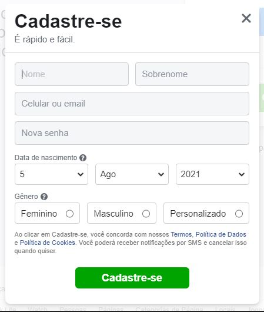

<h1 align="center"> 📝 Formulário de cadastro do Facebook apenas com HTML </h1>

Projeto simples que visa praticar HTML básico/ intermediário e todo conteúdo aprendido no curso referente as aulas de criação de Formulários.

 

  <a href="#-tecnologias">Tecnologias</a>&nbsp;&nbsp;&nbsp;|&nbsp;&nbsp;&nbsp;
  <a href="#-projeto">Sobre o projeto</a>&nbsp;&nbsp;&nbsp;|&nbsp;&nbsp;&nbsp;
  <a href="#-aprendizados">Aprendizados</a>&nbsp;&nbsp;&nbsp;|&nbsp;&nbsp;&nbsp;
  <a href="#-contato">Contato</a>&nbsp;&nbsp;&nbsp;&nbsp;&nbsp;&nbsp;

 

    

 

  

## 🚀 Tecnologias

 

- HTML básico e intermediário (Formulários)

 

## 💻 Projeto

O projeto consiste em recriar a página de cadastro do Facebook, sem estilização (CSS).   Nesse módulo, focamos apenas em praticar o conteúdo dado em aula, que visava aprender os conceitos básico sobre criação de Formulários, tipos de input e etc.
  
Você pode visualizar o projeto [CLICANDO AQUI!](https://jvinicius-ribeiro.github.io/aula-formulario/)

 

 

## 🏆 Aprendizados

Pude aprimorar alguns conceitos básicos aprendidos em HTML e criar esse simples formulário. 
Apesar de não utilizar CSS no projeto, me esforcei para que o mesmo ficasse bem próximo de como realmente é a página. 
Continuarei aplicando conceitos básicos de HTML em alguns outros projetos, mesmo que simples, para dominar da tecnologia.
  

  <h2>👋 <u>Contato</u></h2> 
  

  
  

  

<h3 align="center">Obrigado pela sua visita! Estou aberto à sugestões e feedbacks =)</h3>

